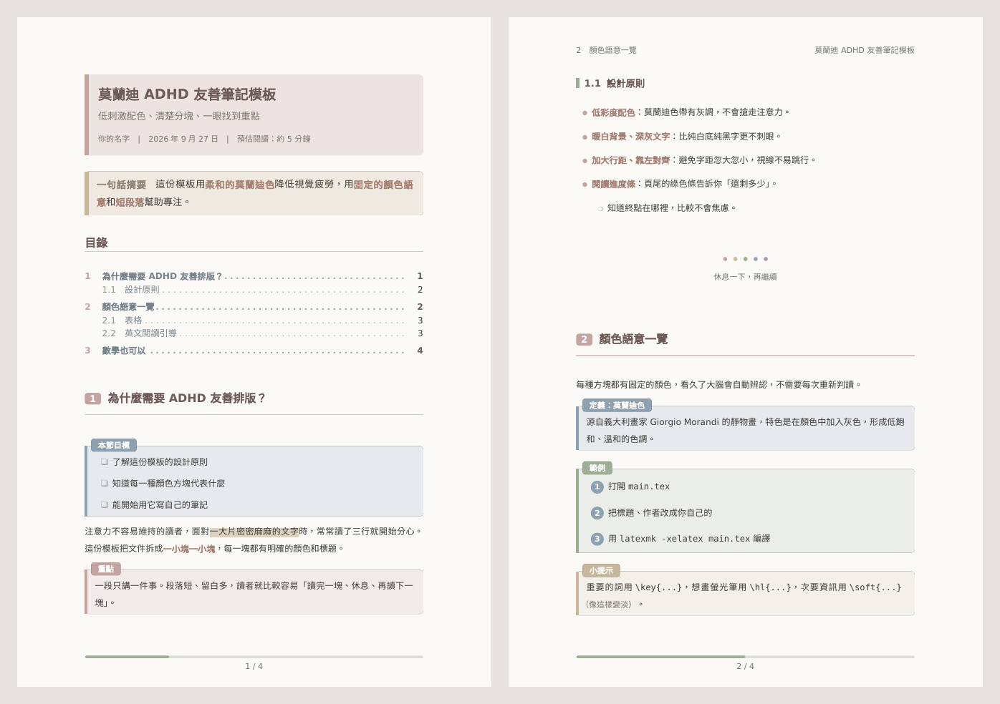
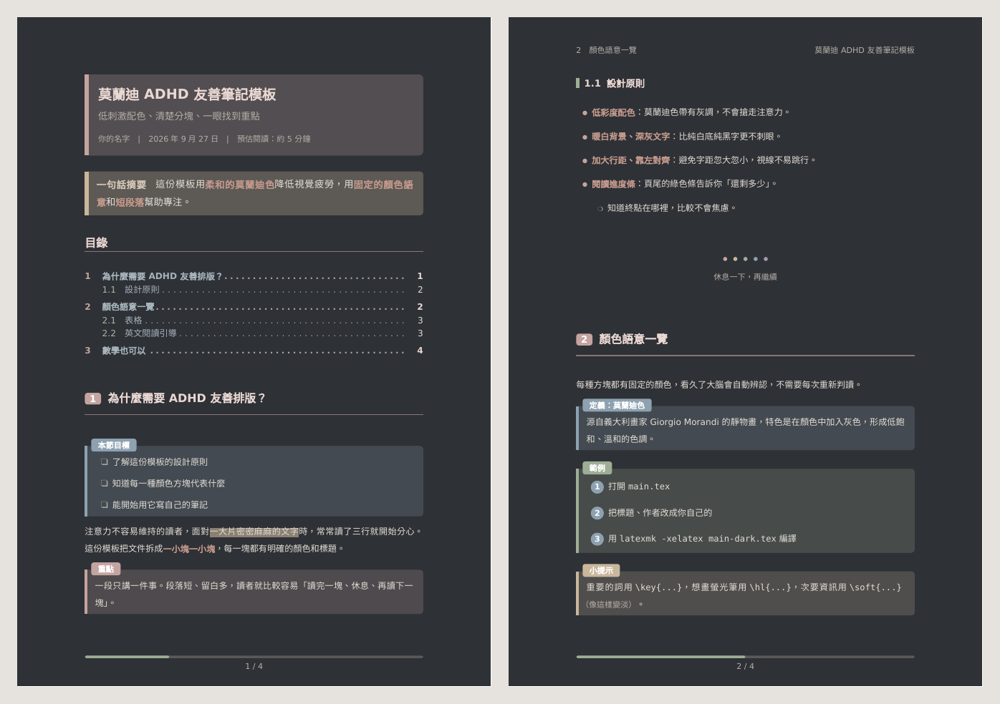

# 莫蘭迪 × ADHD 友善閱讀 LaTeX 模板

一個用**莫蘭迪低彩度配色**、專為 **ADHD／注意力容易分散的讀者**設計的 LaTeX 筆記／講義模板。
支援繁體中文，用 XeLaTeX 編譯。



<details>
<summary>深色護眼模式預覽</summary>



</details>

範例 PDF：[淺色](docs/example.pdf)｜[深色](docs/example-dark.pdf)

---

## 設計理念

| 設計 | 為什麼對 ADHD 讀者有幫助 |
| --- | --- |
| 莫蘭迪低彩度配色 | 顏色柔和不搶眼，降低視覺刺激，又保有足夠區辨度 |
| 暖白底 + 深灰字 | 比純白底純黑字對比柔和，長時間閱讀較不疲勞 |
| 1.6 倍行距、段落留白 | 一段一段分開，視線不容易跳行 |
| 靠左對齊、不斷字 | 避免左右對齊造成的字距忽大忽小 |
| 較寬的左右邊界 | 每行字數變少，更容易讀完一行 |
| **固定顏色語意**的資訊方塊 | 看久了大腦自動辨認「這是重點／範例／警告」 |
| 頁尾閱讀進度條 | 知道「還剩多少」，減少面對長文件的焦慮 |
| 一句話摘要 `tldr`、本節目標 `goals` | 先知道要讀什麼，比較容易進入狀態 |
| 可打勾的 `checklist`、步驟 `steps` | 把大任務拆成小步驟 |
| 休息點 `\takeabreak` | 在長內容中提示讀者可以停一下 |
| 英文閱讀引導 `\bionic{}` | 每三個單字，第一個單字的前兩個字母加粗，給視線固定的落腳點 |

## 快速開始

### 方法一：Overleaf（最簡單）

1. 下載這個 repo（綠色 **Code** 按鈕 → **Download ZIP**）
2. 在 Overleaf 選 **New Project → Upload Project**，上傳 ZIP
3. 左上角 **Menu → Compiler** 改成 **XeLaTeX**
4. 編輯 `main.tex`，按下 Recompile

### 方法二：本機編譯

需要 TeX Live（或 MacTeX／MiKTeX）：

```bash
git clone https://github.com/amelialin90/LaTeX_template.git
cd LaTeX_template
latexmk main.tex        # .latexmkrc 已設定好使用 XeLaTeX
```

### 方法三：當作 GitHub 模板

在 repo 頁面按 **Use this template**，每次 push `.tex` 檔時 GitHub Actions 會自動編譯 PDF，
可到 **Actions** 頁面下載。

## 使用方式

```latex
\documentclass{morandi-adhd}          % 淺色（預設）
% \documentclass[dark]{morandi-adhd}  % 深色護眼
% \documentclass[print]{morandi-adhd} % 列印用（白底）

\title{標題}
\subtitle{副標題}
\author{作者}
\date{\today}
\readingtime{約 10 分鐘}

\begin{document}
\maketitle
\begin{tldr} 一句話說完這份文件在講什麼。 \end{tldr}
...
\end{document}
```

### 類別選項

| 選項 | 效果 |
| --- | --- |
| `dark` | 深色護眼模式 |
| `print` | 白底，適合列印 |
| `compact` | 行距縮為 1.35 倍 |
| `nobionic` | 關閉 `\bionic{}` 效果（直接輸出原文） |
| `12pt` 等 | 其他選項會傳給 `article` |

### 資訊方塊（顏色語意）

| 環境 | 顏色 | 用途 |
| --- | --- | --- |
| `tldr` | 奶茶沙 | 一句話摘要，放在最前面 |
| `goals` | 霧霾藍 | 本節目標 |
| `keypoint` | 灰玫瑰 | 重點 |
| `definition` | 霧霾藍 | 定義 |
| `example` | 鼠尾草綠 | 範例 |
| `tip` | 奶茶沙 | 小提示 |
| `warning` | 陶土紅 | 注意 |
| `question` | 灰紫 | 想一想 |
| `summary` | 鼠尾草綠 | 本節回顧 |

每個方塊都可以加副標題：`\begin{definition}[莫蘭迪色] ... \end{definition}`，方塊可以跨頁。

### 行內與排版指令

| 指令 | 效果 |
| --- | --- |
| `\key{文字}` | 關鍵字（粗體 + 陶土色） |
| `\hl{文字}` | 螢光筆標記，可跨行 |
| `\soft{文字}` | 次要資訊（淡色小字） |
| `\bionic{English text}` | 英文閱讀引導（僅限純英文） |
| `\bionicsetup{every=3, letters=2}` | 調整 `\bionic` 每幾個單字加粗一次、加粗前幾個字母 |
| `\takeabreak` / `\takeabreak[文字]` | 休息點 |
| `\chunkbreak` | 輕量分隔線 |
| `\zebra` + `\headerrow` | 斑馬紋表格、表頭底色 |
| `\morandisectionnewpage` | （導言區）每個 section 從新頁開始 |

### 清單

```latex
\begin{checklist}
  \done 已完成的項目
  \item 還沒完成的項目
\end{checklist}

\begin{steps}
  \item 第一步
  \item 第二步
\end{steps}
```

## 自訂

**換顏色**：在導言區重新定義即可，例如

```latex
\definecolor{MorandiRose}{HTML}{B8A1A8}
```

色盤：`MorandiRose` `MorandiSage` `MorandiBlue` `MorandiSand` `MorandiMauve` `MorandiClay` `MorandiStone`，
以及 `PageBg`（背景）、`TextMain`（主文字）、`TextSoft`（次要文字）、`Heading`（標題）。

**換字型**：模板會自動尋找 Noto Sans CJK TC → 思源黑體 → 蘋方 → 微軟正黑體。要指定其他字型：

```latex
\setCJKmainfont{jf open 粉圓}
```

**改方塊標題文字**（例如改成英文）：

```latex
\renewcommand\keypointname{Key Point}
\renewcommand\tldrname{TL;DR}
```

## 檔案結構

```
morandi-adhd.cls   模板本體
main.tex           範例（淺色）
main-dark.tex      範例（深色）
.latexmkrc         latexmk 設定（使用 XeLaTeX）
docs/              預覽圖與範例 PDF
```

## 授權

[MIT License](LICENSE)，歡迎自由使用、修改與分享。
